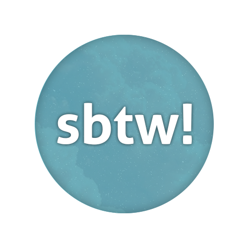

   

The Storyboard Translation Workspace (sbtw!) is an osu! storyboard editor for generating storyboards with C# and .NET. It uses [osu! (lazer)](https://github.com/ppy/osu) as its base. It is inspired by [storybrew](https://github.com/Damnae/storybrew) by Damnae.

## Running sbtw!
Get a copy from the [releases]() page or get it from the links down below to get the latest version:

|[Windows 10+ (x64)]()|[Linux (x64)]()|
|-----------------|-----|

### Notes
- When running on Linux please install a system-wide FFmpeg installation available to support video decoding.

## Contributing
### Issues
Found an issue? Head over to the issues page of this repository and create a new issue.

### Pull Requests
Want your changes to be pushed upstream? Make a PR with details on how it helps out sbtw!.

## License
sbtw!'s code is licensed under the [MIT License](https://opensource.org/licenses/MIT). See the [license file](./LICENSE) for more information. [tl;dr](https://tldrlegal.com/license/mit-license) you can do whatever you want as long as you include the original copyright.
