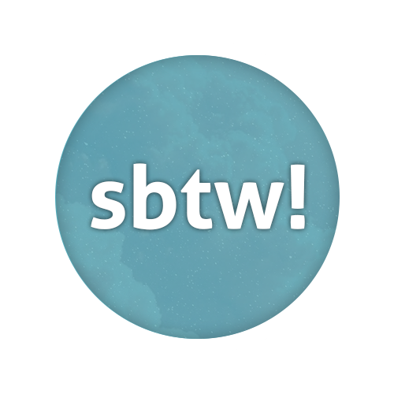

   

The Storyboard Translation Workspace (sbtw!) is an osu! storyboard editor for generating storyboards with scripts written in Lua, Python, Typescript, and Javascript. It uses [osu! (lazer)](https://github.com/ppy/osu) as its base. It is inspired by [storybrew](https://github.com/Damnae/storybrew) by Damnae.

## Running sbtw!
Get a copy from the [releases](https://github.com/LeNitrous/sbtw/releases) page or get it from the links down below to get the latest version:

|[Windows 10+ (x64)](https://github.com/LeNitrous/sbtw/releases/latest/download/sbtw-win-x64.zip)|[Linux (x64)](https://github.com/LeNitrous/sbtw/releases/latest/download/sbtw-ubuntu.20.04-x64.zip)|
|-|-|

### Notes
- When running on Linux please install a system-wide FFmpeg installation available to support video decoding.
- You can use any text editor that has syntax highlighting for convenience however it is highly recommended to use any of the supported code editors listed below to support Intellisense for built-in documentation support.
   - [Visual Studio Code](https://code.visualstudio.com/)
   - [Atom](https://atom.io/)
   - [Sublime Text](https://www.sublimetext.com/)

## Building
You can clone this repository using git or by downloading a copy. However there are some prerequisites that must be met before proceeding.
- [.NET 5.0 SDK](https://dotnet.microsoft.com/en-us/download/dotnet/5.0) or later
- [Visual Studio Code](https://code.visualstudio.com/)
   - see [this article](https://code.visualstudio.com/docs/languages/csharp) for preparing Visual Studio Code in building C# projects.
- [Visual Studio](https://visualstudio.microsoft.com/) (optionally for targeting Windows)
   - see [this article](https://docs.microsoft.com/en-us/windows/apps/windows-app-sdk/) for preparing Visual Studio in using the Windows App SDK.

## Contributing
### Issues
Found an issue? Head over to the [issues page](https://github.com/LeNitrous/sbtw/issues) of this repository and create a new issue.

### Pull Requests
Want your changes to be pushed upstream? Make a pull requests with details on how it helps out sbtw!.

## License
sbtw!'s code is licensed under the [MIT License](https://opensource.org/licenses/MIT). See the [license file](./LICENSE) for more information. [tl;dr](https://tldrlegal.com/license/mit-license) you can do whatever you want as long as you include the original copyright.
